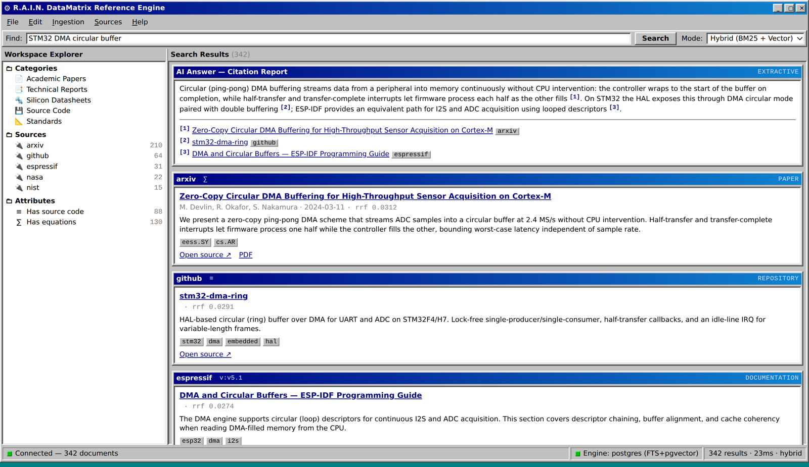

# Vers3Dynamics — R.A.I.N. DataMatrix Reference Engine

[](./LICENSE)
[](https://www.python.org/)
[](docs/ARCHITECTURE.md)

**Engineering answers you can cite.** Search research papers, standards, source code,
and vendor documentation in plain English — with hybrid BM25 + vector retrieval and
citation-first summaries. Self-hostable, open source, and free to run.



Built on the Elasticsearch + Flask search architecture of
[Anna's Archive](https://annas-archive.org); the legacy book and paper search remains
available under [`/legacy`](http://localhost:8000/legacy).

## Features

| Capability | Description |
|---|---|
| Natural-language search | Ask questions in plain English; a local sentence-embedding model powers semantic retrieval. |
| Hybrid retrieval | BM25 lexical matching fused with dense-vector kNN via Reciprocal Rank Fusion. |
| Citation-first answers | Every generated summary is grounded in retrieved documents and cites its sources inline. |
| Document comparison | Side-by-side comparison of two documents by shared terms, categories, and similarity. |
| Code and equation search | Detects source code and LaTeX, so results can be filtered to reference code, datasheets, and standards. |
| PDF indexing | Extracts and indexes text from PDFs (arXiv, NASA, DOE, NIST). |
| Version-aware documentation | Captures documentation versions (for example ESP-IDF `v5.1`, Linux kernel `v6.6`) for precise filtering. |
| Faceted filtering | Filter by source, type, category, language, version, code/equations, and year. |
| Related recommendations | Vector-similarity "more like this" for any document. |
| REST API | Everything the UI does is available as JSON under `/api/v1`. |
| Collections and bookmarks | Save documents into named collections (PostgreSQL). |
| Plugin architecture | Add a new knowledge source in a single file. |

## Supported sources

arXiv, GitHub, NASA Technical Reports (NTRS), DOE OSTI, NIST, IEEE Open Access,
Linux kernel documentation, STM32, Espressif (ESP-IDF), ARM developer docs, and
RISC-V specifications.

## Quickstart

```bash
cp .env.dev .env
docker-compose up --build
```

In another terminal, initialize the search index and load a few offline sample
documents:

```bash
./run flask engine index-init        # create the hybrid Elasticsearch index
./run flask engine collections-init  # create the collections tables
./run flask engine demo              # index sample docs (no network required)
```

Open [http://localhost:8000](http://localhost:8000) and search for
`circular buffer dma`.

To load a real corpus of a few hundred papers in a single command (no API key
required):

```bash
./run flask engine seed-corpus       # ~300 real arXiv papers, idempotent
```

The free Render blueprint runs this automatically in the background on boot.

### Ingesting additional data

```bash
# arXiv control-systems papers
./run flask engine ingest arxiv -q "cat:eess.SY" -n 500

# Popular embedded repositories on GitHub (set GITHUB_TOKEN to lift rate limits)
./run flask engine ingest github -q "topic:rtos stars:>1000" -n 200

# NASA technical reports about propulsion
./run flask engine ingest nasa -q "propulsion" -n 300

# Espressif ESP-IDF documentation (crawler)
./run flask engine ingest espressif -n 200
```

See [`docs/PLUGINS.md`](docs/PLUGINS.md) for every source and its options.

## Architecture

```
                 ┌──────────────────────────────────────────────┐
   Browser  ───▶ │  Flask app (allthethings)                    │
   REST API ───▶ │   ├─ engine_web    modern UI  (/)            │
                 │   ├─ engine_api    REST API   (/api/v1)      │
                 │   ├─ engine_cli    flask engine …            │
                 │   └─ page (legacy) book search (/legacy)     │
                 └───────────────┬──────────────────────────────┘
                                 │
                 ┌───────────────▼──────────────────────────────┐
                 │  engine/  (search core, framework-agnostic)  │
                 │   ├─ search      hybrid BM25 + kNN + RRF      │
                 │   ├─ embeddings  local sentence-transformers  │
                 │   ├─ index       ES hybrid index management   │
                 │   ├─ summarize   citation-first answers       │
                 │   ├─ collections PostgreSQL bookmarks         │
                 │   └─ ingest/     modular source plugins       │
                 └──┬─────────────┬─────────────┬────────────────┘
                    │             │             │
              Elasticsearch   PostgreSQL   sources (arXiv, GitHub, …)
              (BM25+vectors)  (collections)
```

The `engine/` package is framework-agnostic and imports every heavy dependency
lazily, so the application boots even without the machine-learning stack —
falling back to a deterministic embedder and metadata-only indexing. Full design
notes are in [`docs/ARCHITECTURE.md`](docs/ARCHITECTURE.md).

## REST API

```bash
curl "http://localhost:8000/api/v1/search?q=kalman+filter&mode=hybrid&source=arxiv"

curl -X POST http://localhost:8000/api/v1/summarize \
     -H 'Content-Type: application/json' \
     -d '{"q":"how does ESP32 DMA work?"}'
```

Full reference: [`docs/API.md`](docs/API.md).

## Deployment

This is a full-stack application (Flask, Elasticsearch, PostgreSQL, Redis, and a
worker), so it requires a host that runs long-lived, stateful services — not
Vercel or Dappling Network, which are static/frontend hosts and cannot run the
search backend.

- **Zero-cost.** The [`render-free.yaml`](render-free.yaml) blueprint runs the
  whole system free on Render using `ENGINE_BACKEND=postgres` (PostgreSQL
  full-text search plus `pgvector` kNN, no Elasticsearch) — same API, same
  frontend. The container self-initializes and seeds a corpus on boot.
- **Elasticsearch path.** Use [`render.yaml`](render.yaml). Fly.io, Railway, and
  a VPS running `docker-compose` all work as well; initialize with
  `flask engine index-init && flask engine demo`.
- **Static frontend on Vercel or Dappling Network.** Those hosts cannot run the
  backend, but they can serve the included static frontend
  ([`frontend/`](frontend/)) that calls the API. Deploy the backend first, then
  deploy `frontend/` and point it at the API.

Full guide: [`docs/DEPLOYMENT.md`](docs/DEPLOYMENT.md).

## Configuration

Everything is environment-driven (see `.env.dev` and `engine/config.py`). Key
variables:

| Variable | Default | Purpose |
|---|---|---|
| `ENGINE_BACKEND` | `elasticsearch` | Retrieval backend: `elasticsearch` or `postgres` (FTS + pgvector). |
| `ENGINE_INDEX` | `engineering_docs` | Index / table name. |
| `ENGINE_EMBEDDING_MODEL` | `all-MiniLM-L6-v2` | Local sentence-embedding model. |
| `ENGINE_EMBEDDING_FALLBACK` | `false` | Skip the ML model and use the hashing fallback. |
| `ENGINE_DATABASE_URL` | postgres service | Collections/bookmarks database (PostgreSQL or SQLite). |
| `ENGINE_LLM_ENABLED` | `false` | Use a local Ollama LLM for generated answers. |
| `ENGINE_CORS_ORIGINS` | `*` | Allowed origins for the REST API (static frontends). |
| `GITHUB_TOKEN` / `IEEE_API_KEY` | – | Optional, for those sources. |

## Development

```bash
# Run the engine unit tests (pure Python, no infrastructure required)
pytest test/engine -c /dev/null --noconftest

# List and inspect ingestion sources
./run flask engine sources
./run flask engine status
```

## License

Released into the public domain under [CC0](./LICENSE). By contributing you agree
to license your work under the same terms. Built on the search architecture of
Anna's Archive.
